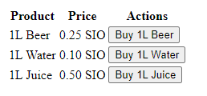
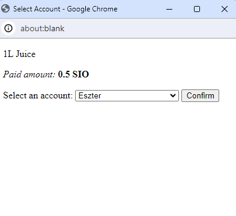
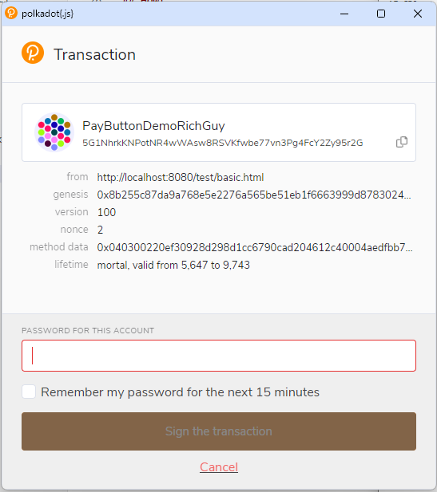

# Pay Button

_This repository contains the code of our Consensus 2024: EasyA Hackathon project._

Welcome to **PAY BUTTON**! Our product is very simple:

* You include this piece of code in your webpage:

```html
<pay-button price="0.25" to="<<receiving address>>" note="1L Beer" completed="onPaymentCompleted(event)">
    Buy 1L Beer
</pay-button>
```

_NOTE: Replace `<<receiving address>>` with your own receiving address._

* Then, you just write a function to process the payment result:

```javascript
function onPaymentCompleted(event) {
    // Prints 'SUCCESS' or 'ERROR'
    console.log('Payment completed:', event.status);
}
```

## How?

The `<pay-button>` is a [_custom web element_](https://developer.mozilla.org/en-US/docs/Web/API/Web_components/Using_custom_elements). The code also bundles parts of the Polkadot.JS SDK to interact with the blockchain. When you click the button, the following happens:

* We first interact with the Polkadot.JS extension, so your dApp is registered with it.
* Then, we show a dialog to select the address you are paying _from_.
* Then, the extension shows you the sign transaction dialog. We are using the `balances.transferKeepAlive` extrinsic to send the payment.
* Finally, we process the blockchain result, and call your hook.

## Why?

By using _custom web elements_, the `<pay-button>` requires **no frontend frameworks**. You can drop it into any project, include the code from CDN, or bundle it with a module bundler, and it should _just work_.

We believe that it is literally the **easiest way to start accepting payments online**.

## Screenshots






